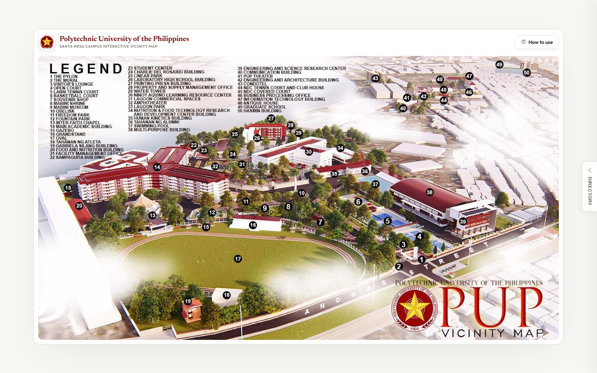

# PUP Vicinity Map

<p align="center">
  <strong>Interactive Santa Mesa campus image map with a searchable directory.</strong><br>
  Vanilla HTML, CSS, and JavaScript in a single page.
</p>

<p align="center">
  <a href="https://cikeyz.github.io/pup-vicinity-map/">Live Demo</a>
  &nbsp;·&nbsp;
  <a href="#quick-start">Quick Start</a>
  &nbsp;·&nbsp;
  <a href="#project-structure">Structure</a>
  &nbsp;·&nbsp;
  <a href="#license">License</a>
</p>

<p align="center">
  
  
  
  
  
</p>

## Contents

- [Overview](#overview)
- [Features](#features)
- [Screenshots](#screenshots)
- [Quick Start](#quick-start)
- [Project Structure](#project-structure)
- [Other Design Eras](#other-design-eras)
- [License](#license)
- [Course Note](#course-note)

## Overview

PUP Vicinity Map turns a campus basemap into an interactive directory. Users hover and click locations, search the list, and explore hotspots without a map SDK or backend. The basemap ships as a local image for offline-friendly demos.

## Features

| Feature | Description |
|---------|-------------|
| Image map hotspots | Clickable areas on the campus map |
| Directory panel | Search and filter locations |
| Offline-friendly | Local `stamesa.jpg` asset |

## Screenshots

| Map |
|-----|
|  |

## Quick Start

```bash
git clone https://github.com/cikeyz/pup-vicinity-map.git
cd pup-vicinity-map
python -m http.server 8000
# http://localhost:8000
```

## Project Structure

```text
pup-vicinity-map/
├── index.html
├── stamesa.jpg
├── LICENSE
├── README.md
└── docs/
    └── screenshots/
        └── map.png
```

## Other Design Eras

| Branch | Description |
|--------|-------------|
| `overhaul/dark-offline` | Dark offline-first layout |
| `overhaul/dark-premium` | Dark premium styling |
| `overhaul/light-split` | Light split map + directory |

## License

MIT. See [LICENSE](LICENSE).

Campus imagery and PUP marks belong to the Polytechnic University of the Philippines.

## Course Note

Built for CMPE 364 (Web and Mobile Systems), Polytechnic University of the Philippines, under Engr. Arlene B. Canlas. Published here as a standalone project.
